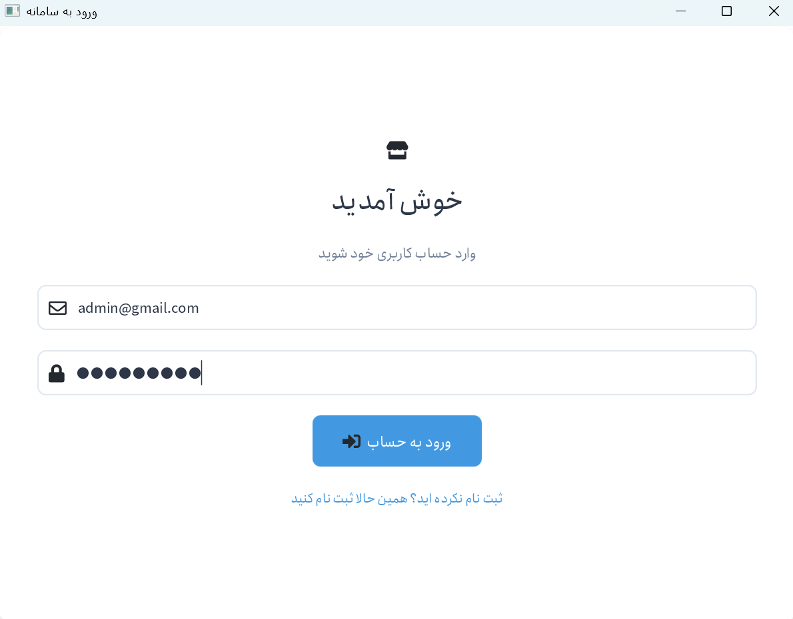
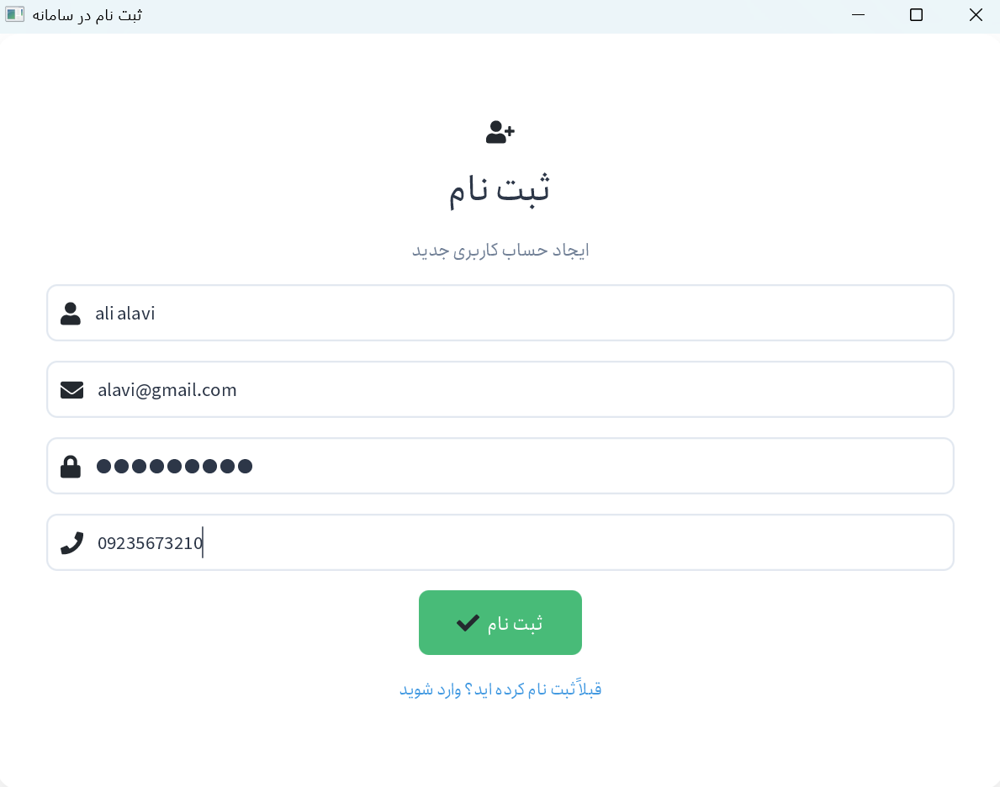
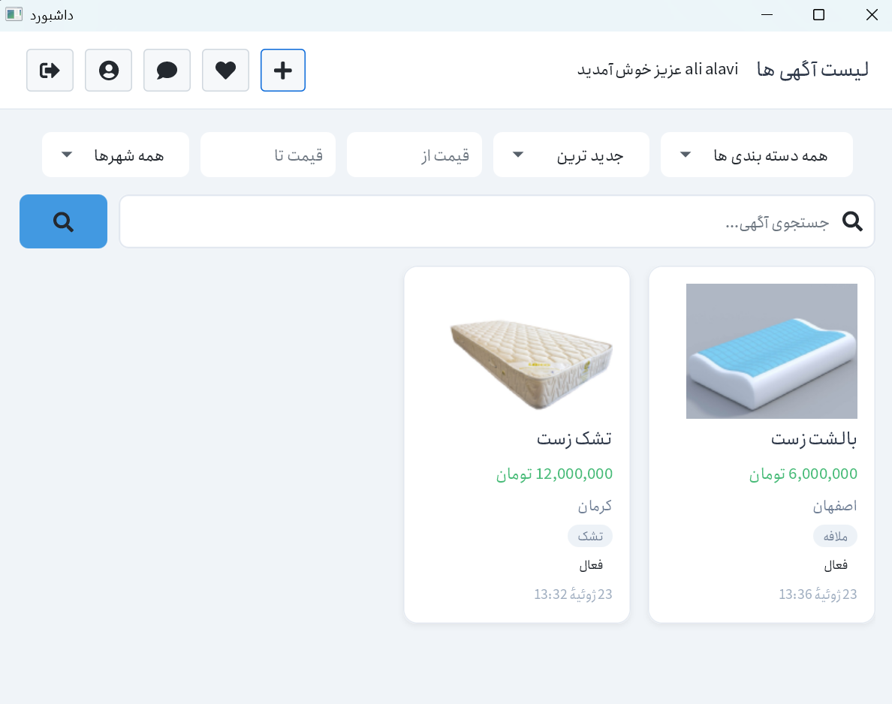
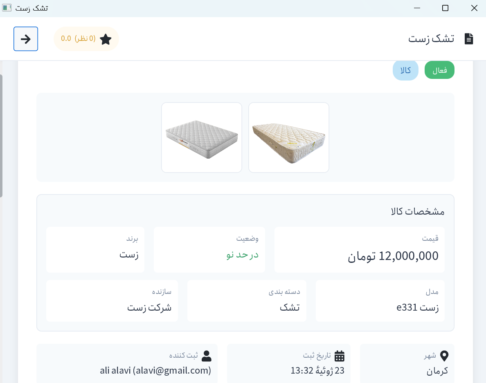
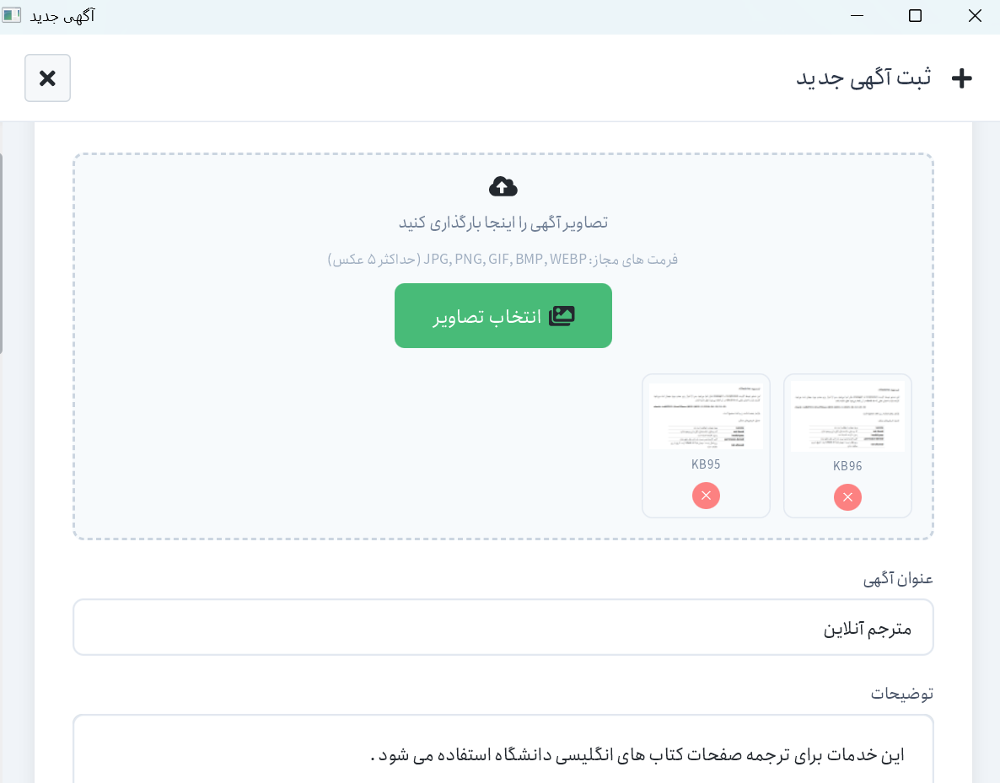
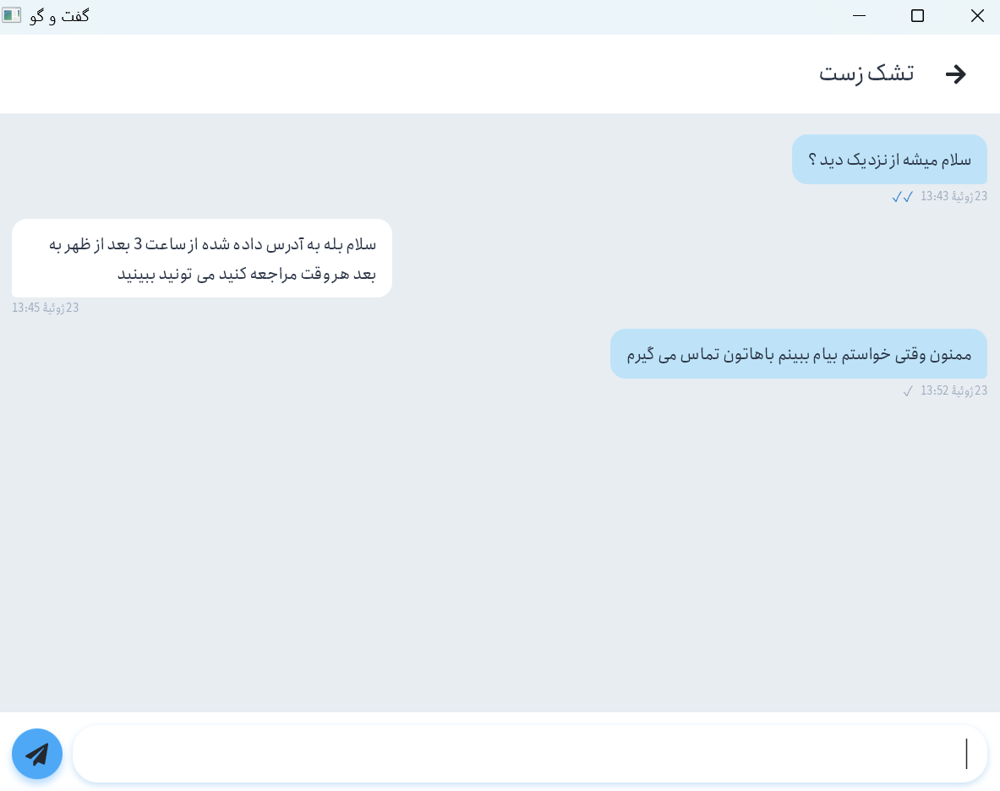
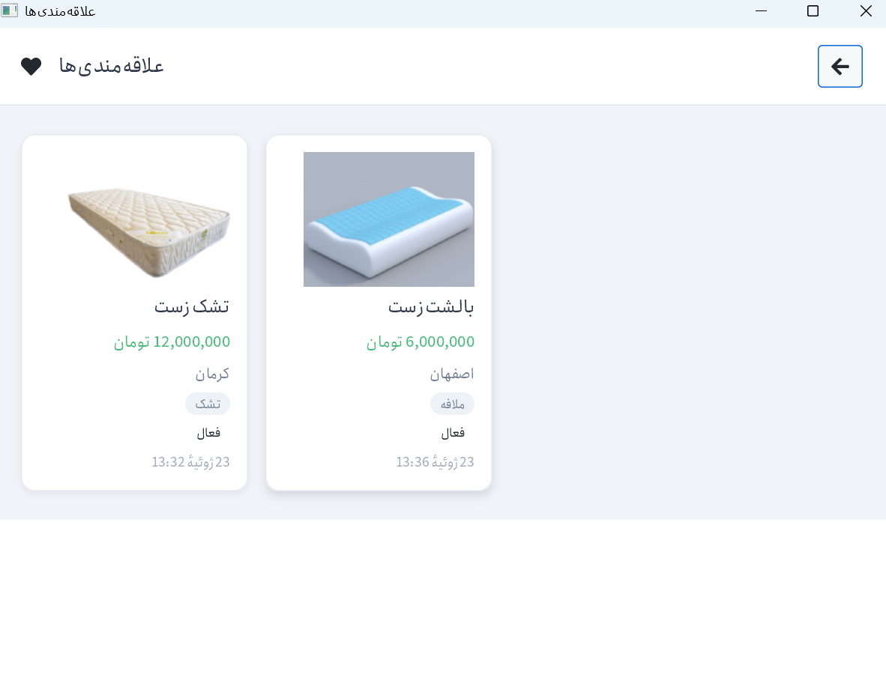
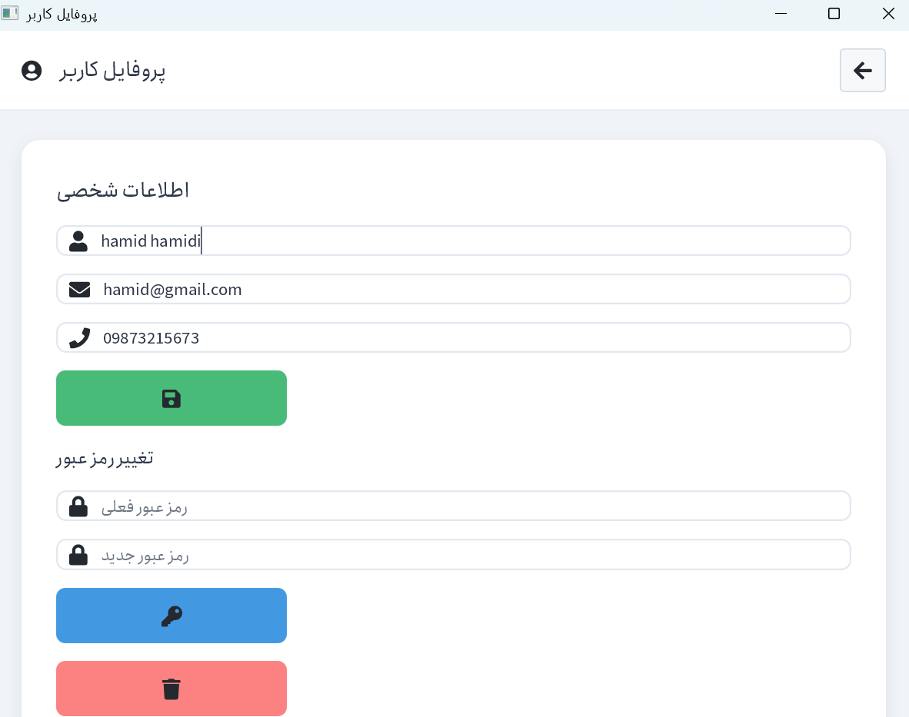
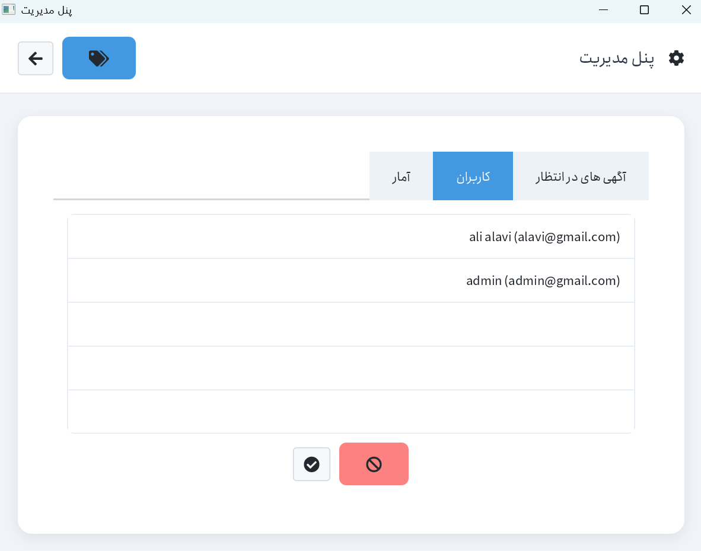
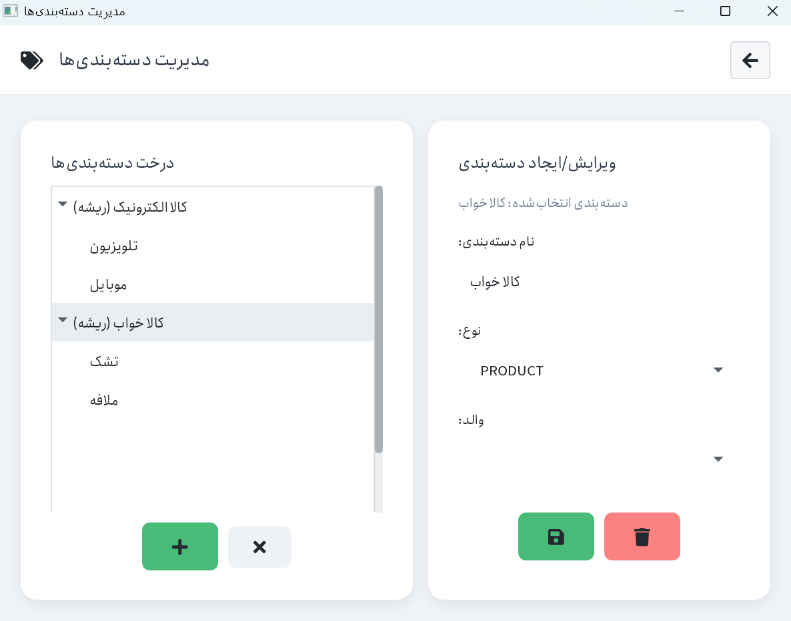

# SecondHand Marketplace


A desktop client-server marketplace for buying and selling second-hand goods. Developed for the **Advanced Programming** course at **Amirkabir University of Technology**.

## Team
- Ali Nazari
- Mohammadreza Kheradmand

## Table of Contents
1. Overview
2. Features
3. Technologies
4. Project Structure
5. Prerequisites
6. Installation
7. Backend Setup
8. Frontend Setup
9. Storage
10. Test Accounts
11. Screenshots
12. Architecture
13. Building the Project
14. Responsibilities
15. Contact
16. Git & Commit Notes

## Overview
Users can register, login, publish advertisements, edit or delete them, search products, save favourites, rate sellers, chat, and manage the system through an administrator panel.

## Features
### Authentication
- Register
- Login
- JWT Authentication
- Password hashing
- Prevent unauthorized access to advertisements 

### Advertisement
- Create/Edit/Delete Advertisement
- Changing Advertisement status by seller
- Approval Workflow
- Status Management

### Chat
- Private conversations for each advertisement
- Seen messages

### Favorites
- Add/Remove favorites

### Rating
- Rating seller
- See the average rating of each seller

### Admin
- Ban/Unban users
- Accept/Reject advertisements
- Category management
- Dashboard & statistics

## Technologies
### Backend
- Java 21
- Spring Boot
- Spring Security
- Spring Data JPA
- Maven
- JWT

### Frontend
- JavaFX
- FXML
- CSS

### Database

- SQLite
- Spring Data JPA (Hibernate)

## Project Structure
```text
backend/
 ├── controller
 ├── service
 ├── repository
 ├── entity
 ├── dto
 ├── exception
 ├── JUnit tests
 └── MainApplication

frontend/
 ├── app
 ├── controller
 ├── component
 ├── model
 ├── service
 ├── config
 └── resources/
      ├── css
      ├── fxml
      ├── font
      └── image
```

## Prerequisites
- JDK 21+
- Maven 3.9+
- SQLite

## Installation
```text
git clone https://github.com/AliNazari362/secondhand-java-project.git

cd secondhand-java-project
```

## Backend Setup

### 1. Configure the Database

Create a PostgreSQL database (or use SQLite if configured) and update the database connection settings in:

```text
backend/src/main/resources/application.properties
```

Make sure the following properties match your database configuration:

```properties
spring.datasource.url=...
spring.datasource.username=...
spring.datasource.password=...
```
> **Note:** The required database tables are created automatically by Hibernate when the application starts for the first time.


---

### 2. Build the Project

Open a terminal inside the `backend` directory and build the project:

```bash
cd backend
mvn clean install
```

---

### 3. Run the Backend

Start the Spring Boot server using Maven:

```bash
mvn spring-boot:run
```

Alternatively, if you are using **IntelliJ IDEA**, you can run the backend from the **Maven** tool window by executing:

1. `clean`
2. `spring-boot:run`

This is the workflow used during the development of this project.

---

### 4. Verify the Server

If everything is configured correctly, the backend will start successfully and listen on:

```text
http://localhost:8080
```
## Frontend Setup

### 1. Make Sure the Backend is Running

Before starting the frontend application, ensure that the backend server is already running.

---

### 2. Run the Frontend

From the `frontend` directory, execute:

```bash
mvn javafx:clean
mvn javafx:run
```

Alternatively, in **IntelliJ IDEA**, open the **Maven** tool window and execute the following goals in order:

1. `javafx:clean`
2. `javafx:run`

This is the workflow used during the development of this project.

---

### 3. Verify the Application

If everything is configured correctly, the login window will appear and the application will be ready to use.
## Storage

The application uses **SQLite** as its primary database during development.

Application data—including user accounts, advertisements, categories, chat messages, favorites, and seller ratings—is persisted using **Spring Data JPA (Hibernate)**, which provides object-relational mapping (ORM) and database persistence.

The database file is created automatically when the application is started for the first time.

## Test Accounts

To simplify the evaluation process, the following test accounts are included with the project:

| Role | Email | Password |
|------|-------|----------|
| **Administrator** | `admin@gmail.com` | `admin1234` |
| **User** | `alavi@gmail.com` | `alavi1234` |
| **User** | `hamid@gmail.com` | `hamid1234` |
| **User** | `hadi@gmail.com` | `hadi12345` |

The administrator account can be used to test administrative features such as user management, advertisement approval, and category management.

If these accounts have been removed or modified, new user accounts can be created through the **Register** page. Administrator privileges can be granted by updating the user's role in the database.

## Screenshots

### Login

The login page allows registered users to authenticate using their email and password.



---

### Register

New users can create an account using the registration page.



---

### Home

The home page displays all available advertisements and provides search and filtering options.



---

### Advertisement Details

Users can view complete information about an advertisement and contact the seller.



---

### Create Advertisement

Users can publish new advertisements by filling out the required information.



---

### Chat

The chat system enables direct communication between buyers and sellers.



---

### Favorites

Users can save advertisements for quick access.



---

### Profile

Users can update their profile information and change their password.



---

### Admin Dashboard

Administrators can manage users, advertisements, and categories.



---

### Category Management

Administrators can create, edit, and delete advertisement categories.



## Backend Architecture

The project follows a **Layered Architecture** pattern:

```text
Controller (REST API)
   ↓
Service (Business Logic)
   ↓
Repository (Data Access)
   ↓
Database (PostgreSQL / SQLite)
```
| Layer	 | Responsibility |
|------|-------|
| **Controller** | `Handles HTTP requests, performs basic validation, and returns responses to the client` |
| **Service** | `Implements business logic, advanced validation, and access control` |
| **Repository** | `Manages database communication using Spring Data JPA` |
| **Database** | `	Provides persistent storage (SQLite)` |

This structure ensures separation of concerns and high testability across the project.


## Testing

All backend unit tests are written using **JUnit 5** and located in the `backend/src/test/java` directory.

You can run the tests directly from your IDE (such as IntelliJ IDEA or VS Code) by right-clicking on the `test` folder or individual test classes and selecting **Run** or **Run as JUnit**.

> **Note:** The tests cover all core services including authentication, advertisements, chat, comments, ratings, favorites, and admin operations.


## Future Improvements

| Feature | Description | Priority |
|---------|-------------|----------|
| **Docker** | Full containerization with Docker Compose for easy deployment | High |
| **CI/CD** | Automate build, test, and deployment using GitHub Actions | High |
| **Email Verification** | Verify user emails during registration to prevent fake accounts | Medium |
| **Push Notifications** | Real-time alerts for new messages and ad status changes | Medium |
| **WebSocket / Real-time Chat** | Upgrade chat to real-time messaging | Medium |
| **Advanced Filtering** | Add filters like exact price range, date, and condition | Low |
| **Dark Mode** | Add a dark theme to the JavaFX UI | Low |
| **Multi-language Support** | Support both Persian and English languages | Low |
## Building the Project
### Option 1 : Using the Provided Script (for Windows)
A run.bat script is located in the root directory of the project. This script will start both the backend and frontend automatically.

How to use:

1. Double-click the run.bat file in the project root folder.

2. Two terminal windows will open:

    One for the Backend Server (Spring Boot)

    One for the Frontend Application (JavaFX)

3. Wait a few seconds for both services to start.
### Option 2: Running on Linux / macOS
A run.sh script is provided for Linux and macOS users.

How to use:

1. Make the script executable:

```bash
chmod +x run.sh
```
2. Run the script:

```bash
./run.sh
```
The script will:

1. Start the backend server

2. Wait 8 seconds for it to initialize

3. Start the frontend application

>Note: If you are using a different terminal emulator, you may need to modify the script to use your preferred terminal (e.g., konsole, termite, alacritty).
### Option 3: Running Manually (Using Terminal)
If you prefer to run the services manually, follow these steps:

1. Start the Backend :
Open a terminal (Command Prompt, PowerShell, or IntelliJ Terminal) 
and run:

```bash
cd backend
mvn spring-boot:run
```
The backend will start on http://localhost:8080.

2. Start the Frontend
Once the backend is running, open a new terminal and run:

```bash
cd frontend
mvn javafx:run
```
The JavaFX desktop application will open.

>Important: Always start the backend before the frontend.

### Option 4: Using IntelliJ IDEA Maven Tool Window
If you are using IntelliJ IDEA:

1. Open the Maven tool window (View → Tool Windows → Maven).

2. Expand the backend module → Plugins → spring-boot → double-click spring-boot:run.

3. Expand the frontend module → Plugins → javafx → double-click javafx:run.

>Note: This method uses IntelliJ's built-in Maven and does not require any additional configuration.
## Responsibilities

### Ali Nazari
Backend: Entity, DTO, Controller, MainApplication
Frontend: Service, Exception, Utils, FXML, CSS

### Mohammadreza Kheradmand
Backend: Repository, Service, Exception, Debugging
Frontend: App, Component, Controller, Model

## Contact

If you have any questions, suggestions, or feedback regarding this project, feel free to reach out to us:

| Team Member | Role | Email |
|-------------|------|-------|
| **Ali Nazari** | Backend & Frontend Developer | ali.nazari86@aut.ac.ir|
| **Mohammadreza Kheradmand** | Backend & Frontend Developer | mohammad.kherad@aut.ac.ir|

**GitHub Repository:** [github.com/AliNazari362/secondhand-java-project](https://github.com/AliNazari362/secondhand-java-project)

> We welcome any feedback or contributions to improve the project!

## Git & Commit Notes

- All commits made under the username **`student 62`** belong to **Mohammadreza Kheradmand**, one of the core developers of this project.
- This username is used for academic/educational purposes and should not be confused with other contributors.

 
## License
This project was developed for educational purposes as part of the Advanced Programming course.

---
Amirkabir University of Technology — Spring 1405

